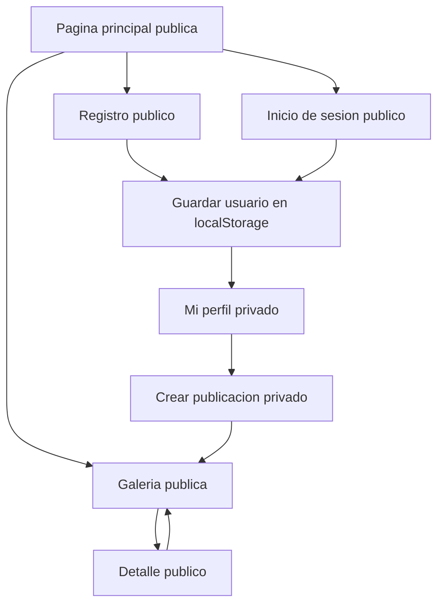

# 02 - Navegacion entre vistas

El marketplace tiene dos grupos de vistas: publicas y privadas.

## Vistas publicas

No requieren inicio de sesion:

- Pagina principal: `#home`
- Registro de usuarios: `#register`
- Inicio de sesion: `#login`
- Galeria de publicaciones: `#gallery`
- Detalle de publicacion: `#detail/:id`

## Vistas privadas

Requieren usuario guardado en `localStorage`:

- Mi perfil: `#profile`
- Crear publicacion: `#create`

## Regla de sesion en client

Cuando el usuario inicia sesion o se registra, el prototipo guarda:

```json
{
  "id": 1,
  "name": "Usuario Demo",
  "email": "demo@mercadovecino.cl"
}
```

La informacion queda en `localStorage` con la clave `mercadoVecinoUser`.

Si una persona intenta entrar a una vista privada sin sesion, el client muestra una pantalla de bloqueo y ofrece ir a inicio de sesion.

## Flujo de navegacion



