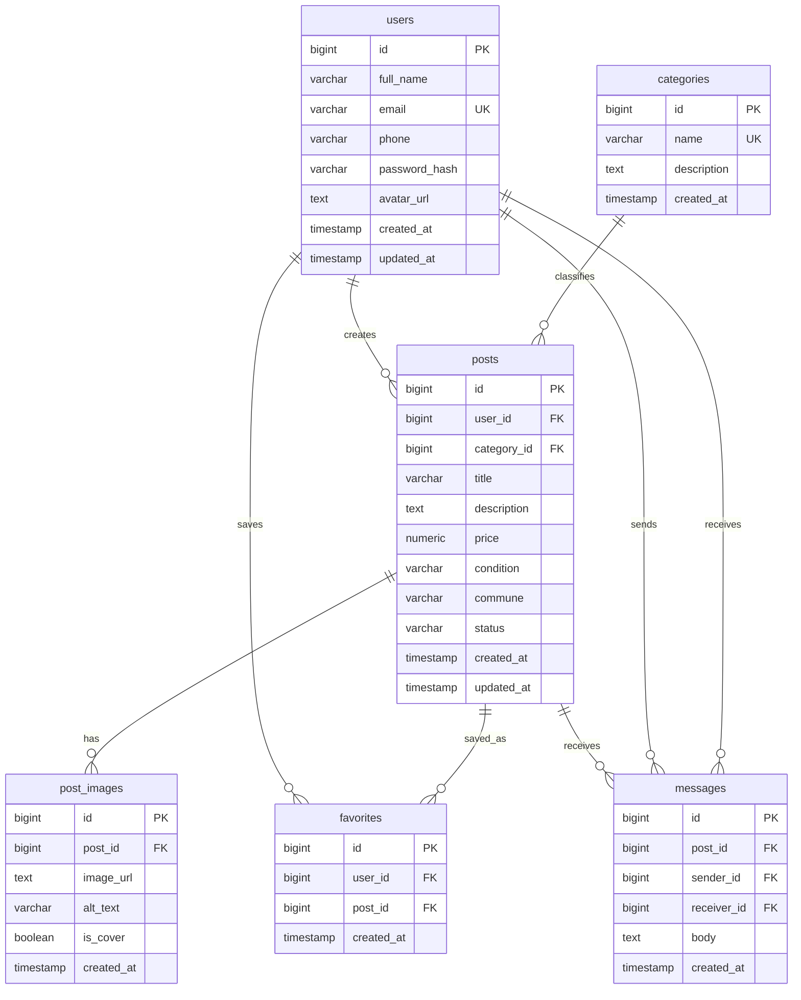

# 04 - Diseño de base de datos

Motor propuesto: PostgreSQL.

## Tablas y atributos

### users

| Campo | Tipo | Descripcion |
| --- | --- | --- |
| id | BIGSERIAL PK | Identificador unico. |
| full_name | VARCHAR(120) | Nombre completo. |
| email | VARCHAR(160) UNIQUE | Correo de acceso. |
| phone | VARCHAR(30) | Telefono opcional. |
| password_hash | VARCHAR(255) | Contrasena encriptada. |
| avatar_url | TEXT | Imagen de perfil opcional. |
| created_at | TIMESTAMP | Fecha de registro. |
| updated_at | TIMESTAMP | Fecha de actualizacion. |

### categories

| Campo | Tipo | Descripcion |
| --- | --- | --- |
| id | BIGSERIAL PK | Identificador unico. |
| name | VARCHAR(80) UNIQUE | Nombre de categoria. |
| description | TEXT | Descripcion. |
| created_at | TIMESTAMP | Fecha de creacion. |

### posts

| Campo | Tipo | Descripcion |
| --- | --- | --- |
| id | BIGSERIAL PK | Identificador unico. |
| user_id | BIGINT FK users.id | Usuario vendedor. |
| category_id | BIGINT FK categories.id | Categoria. |
| title | VARCHAR(140) | Titulo. |
| description | TEXT | Descripcion. |
| price | NUMERIC(12,2) | Precio. |
| condition | VARCHAR(30) | Estado del producto. |
| commune | VARCHAR(80) | Comuna. |
| status | VARCHAR(20) | Estado de publicacion. |
| created_at | TIMESTAMP | Fecha de creacion. |
| updated_at | TIMESTAMP | Fecha de actualizacion. |

### post_images

| Campo | Tipo | Descripcion |
| --- | --- | --- |
| id | BIGSERIAL PK | Identificador unico. |
| post_id | BIGINT FK posts.id | Publicacion asociada. |
| image_url | TEXT | URL de imagen. |
| alt_text | VARCHAR(160) | Texto alternativo. |
| is_cover | BOOLEAN | Indica imagen principal. |
| created_at | TIMESTAMP | Fecha de creacion. |

### favorites

| Campo | Tipo | Descripcion |
| --- | --- | --- |
| id | BIGSERIAL PK | Identificador unico. |
| user_id | BIGINT FK users.id | Usuario que guarda favorito. |
| post_id | BIGINT FK posts.id | Publicacion guardada. |
| created_at | TIMESTAMP | Fecha de creacion. |

### messages

| Campo | Tipo | Descripcion |
| --- | --- | --- |
| id | BIGSERIAL PK | Identificador unico. |
| post_id | BIGINT FK posts.id | Publicacion consultada. |
| sender_id | BIGINT FK users.id | Usuario comprador/interesado. |
| receiver_id | BIGINT FK users.id | Usuario vendedor. |
| body | TEXT | Mensaje. |
| created_at | TIMESTAMP | Fecha de creacion. |

## Relaciones

- Un usuario tiene muchas publicaciones: `users 1:N posts`.
- Una categoria tiene muchas publicaciones: `categories 1:N posts`.
- Una publicacion tiene muchas imagenes: `posts 1:N post_images`.
- Un usuario puede guardar muchas publicaciones favoritas: `users N:M posts` mediante `favorites`.
- Una publicacion puede tener muchos mensajes: `posts 1:N messages`.
- Los mensajes relacionan emisor y receptor con usuarios.

## Diagrama ER

